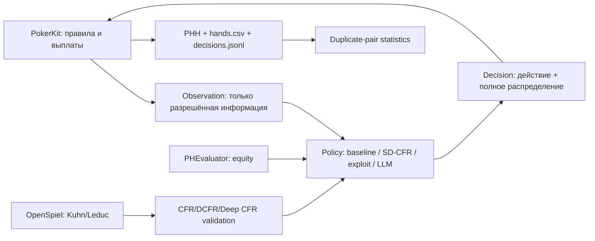

# Исследовательская дорожная карта

## 1. Цель магистерской работы

Цель проекта — построить воспроизводимую систему обучения и оценки покерных агентов и
проверить, может ли агент одновременно:

1. статистически значимо выигрывать у заранее определённого слабого соперника;
2. сохранять приемлемую защищённость против неизвестных и сильных стратегий;
3. безопасно усиливать эксплуатацию соперника по мере накопления наблюдений.

Рабочая формулировка темы:

> **Нейросетевое минимизирование сожаления и безопасная адаптация к ограниченно
> рациональным соперникам в heads-up no-limit Texas hold'em.**

Это сильнее и научно честнее формулировки «LLM научилась играть в покер». LLM здесь может
быть отдельным соперником, интерпретируемым модулем или интерфейсом к инструментам, но
основной результат должен опираться на измеримую стратегию, корректный игровой движок и
заранее определённую статистическую процедуру.

## 2. Текущее состояние: что считается P0

### 2.1. Legacy-контур

Каталоги `pypokerengine/`, `examples/players/` и исторические TSV/графики сохраняются как
архив бакалаврской работы и источник регрессионных тестов. Они **не являются** канонической
средой для новых заявлений о силе агента.

Аудит `examples/players/mlplayerddqn.py` выявил методологические дефекты уровня P0:

- в replay buffer попадает только последнее решение руки с `done=True`; многошаговый
  Bellman backup и параметр `gamma` фактически не работают;
- сила руки до флопа всегда равна `0.5`, а состояние не содержит полного размера колла,
  относительной позиции, истории ставок и эффективного стека;
- приоритеты replay не обновляются по новому TD error, а importance weights применяются к
  уже агрегированному scalar MSE;
- target network синхронизируется до загрузки checkpoint и не синхронизируется после неё;
- evaluation по умолчанию сохраняет и дообучает модель, а ненулевой `epsilon` смешивает
  исследование и измерение;
- размер рейза всегда минимальный; невалидный минимум может быть передан движку и дать
  расхождение между записанным и реально исполненным действием;
- несколько агентов могут читать и перезаписывать один checkpoint.

Дополнительно legacy-движок и его evaluator требуют отдельных differential-тестов на
ничьи, kicker, side pot и all-in. Поэтому исправлять отдельные симптомы DDQN внутри старого
контура недостаточно: сначала нужна надёжная контрольная среда.

Контрольный замер замороженного legacy-checkpoint `model_8` при `epsilon=0` против
`FishPlayer` дал около `-0.378 bb/100` на 50 seat-swapped парах; 95%-й интервал на уровне пар
`[-15.43; 4.43] bb/100`. Это диагностический, а не новый подтверждающий эксперимент, но он
однозначно не подтверждает тезис «текущая DDQN обыгрывает фиша». Исторические результаты,
полученные с дообучением во время матча или без парного дизайна, нельзя использовать как
confirmatory evidence.

### 2.2. Новый исследовательский контур

Пакет `poker_research/` является новым source of truth:

- **PokerKit 0.7.4** — правила HUNL, переходы состояния, расчёт выплат и экспорт Poker Hand
  History (PHH);
- **PHEvaluator 0.5.3.1** — быстрый 5/6/7-card evaluator для equity Monte Carlo;
- **OpenSpiel 1.6.15** — CFR, best response и exploitability в малых играх с известным
  деревом;
- `Observation -> Decision` — узкая граница политики без доступа к объекту движка и скрытым
  картам;
- `uv.lock`, Python 3.12, CI, типизация и тесты — воспроизводимая программная среда;
- PHH, CSV, JSONL и manifest с SHA-256 — проверяемый след каждого эксперимента.



PokerKit отвечает за истинность игры, PHEvaluator — только за оценку комбинаций/equity, а
OpenSpiel — за задачи, где можно вычислить best response и exploitability. Ни одна библиотека
не подменяет две другие.

## 3. Проверяемые гипотезы

### H1. Прозрачный exploitative baseline

Замороженная `equity_value_v1` имеет положительный ожидаемый выигрыш против
`calling_station_v1` в игре heads-up NLHE с эффективным стеком 100 BB, без rake и ante.

- **Первичный estimand:** средний выигрыш hero в `bb/100` на одну duplicate-пару.
- **Нулевая гипотеза:** `E[bb/100] <= 0`.
- **Успех:** нижняя граница одностороннего 95%-го t-интервала выше нуля.
- **Практический успех:** та же граница выше заранее выбранной ненулевой границы, например
  `+5 bb/100`.

Финальная confirmatory-конфигурация заранее задаёт `practical_margin_bb100 = 5.0`: её строгий
критерий успеха — односторонняя нижняя 95%-я граница выше `+5 bb/100`. Pilot использует
нулевую границу только для диагностики. Любой новый порог нужно снова фиксировать **до**
просмотра соответствующих confirmatory seeds.

### H2. Game-theoretic blueprint

Реализация DCFR/Deep CFR/SD-CFR:

- сходится к известному решению в Kuhn poker;
- достигает заранее заданного exploitability threshold в Leduc poker;
- лучше legacy-DDQN и прозрачного baseline против пула соперников при одинаковом бюджете
  решений и одинаковом evaluation protocol.

Точное значение порога задаётся после запуска reference-алгоритма OpenSpiel, но до обучения
исследуемой реализации. Подбирать порог по результату собственной модели нельзя.

### H3. Безопасная адаптация

Адаптивный агент улучшает выигрыш относительно замороженного blueprint против минимум трёх
классов слабых соперников (calling station, over-folder, over-aggressor), не превышая заранее
заданный бюджет ухудшения против blueprint/robust opponent pool.

Слово «безопасная» означает измеримый guardrail, а не субъективное впечатление. Возможная
операционализация:

- exploit-policy строится из модели соперника;
- коэффициент смешивания с blueprint растёт только при достаточной уверенности;
- lower confidence bound выигрыша против целевого соперника должен улучшиться;
- upper confidence bound потери против robust pool или LBR не должен превысить заданный
  бюджет, например `1 bb/100` либо `epsilon` exploitability в малой игре.

Формальную game-theoretic гарантию можно заявлять только после доказательства. До этого
корректный термин — **confidence-gated conservative adaptation**.

## 4. Протокол оценки, который нельзя менять после старта

### 4.1. Игровая единица

Базовый режим: HUNL cash, два игрока, стек 200 chips, blinds 1/2, 100 BB effective, без rake
и ante; после каждой руки стеки сбрасываются. Один случайный seed задаёт один порядок колоды.

В duplicate-паре этот порядок используется дважды:

1. leg A: hero на seat 0, opponent на seat 1;
2. leg B: opponent на seat 0, hero на seat 1.

Наблюдение пары:

```text
pair_bb100 = 50 * (hero_payoff_leg_A + hero_payoff_leg_B) / big_blind
```

Пара, а не рука и не отдельный leg, является независимой статистической единицей. Такой
дизайн компенсирует большую часть card luck и позиционного преимущества.

### 4.2. Preregistration

До confirmatory-запуска фиксируются в TOML и Git:

- checkpoint и hash политики;
- версии движка и зависимостей;
- список/генератор соперников;
- правила, action abstraction и timeout;
- master seed, число duplicate-пар и bootstrap seed;
- первичный estimand, направление теста, `alpha` и practical margin;
- критерии invalid run и политика обработки ошибок;
- все planned secondary comparisons.

Pilot seeds используются только для отладки, оценки дисперсии, мощности и выбора
гиперпараметров. После любого изменения политики, threshold или action abstraction следующий
запуск снова считается pilot. Confirmatory seeds нельзя использовать для настройки.

### 4.3. Мощность и фиксированный горизонт

Число пар оценивается по pilot standard deviation и минимальному интересующему эффекту:

```bash
uv run poker-benchmark power \
  --standard-deviation 120 \
  --effect 10 \
  --alpha 0.05 \
  --power 0.90
```

Это normal approximation; итоговый размер выборки округляется вверх и фиксируется до
запуска. Запрещены optional stopping, повторный просмотр p-value и продолжение «до
значимости». При досрочном техническом падении run считается failed, причина остаётся в
`errors.jsonl`, а повтор использует новый зарегистрированный run id.

### 4.4. Метрики

| Уровень | Метрика | Решающее правило |
|---|---|---|
| Primary | mean duplicate `bb/100` | one-sided lower 95% CI `> 0` |
| Practical | mean duplicate `bb/100` | lower 95% CI `> margin` |
| Sensitivity | pair bootstrap 95% CI | знак и порядок величины согласуются с primary |
| Small games | exploitability / NashConv | не хуже preregistered threshold |
| HUNL safety | LBR или RL-BR value | не хуже blueprint сверх safety budget |
| Reliability | illegal action / crash / missing hand | ровно 0 в valid run |
| Systems | p50/p95 decision latency, fallback rate | ниже заранее заданного SLA |

T-test является primary, bootstrap — sensitivity check, а не способом выбрать более удобный
интервал. При нескольких соперниках/моделях secondary p-values корректируются, например
Holm method. Для нескольких training seeds вывод строится и на уровне seed, и на уровне
duplicate-пар; нельзя выдавать тысячи рук одного checkpoint за тысячи независимых обучений.

### 4.5. Артефакты и data quality

Каждый успешный run создаёт новый непустой каталог и содержит:

- `preregistered_config.toml` — фактически использованная конфигурация;
- `manifest.json` — run id, Git SHA/dirty flag, runtime, версии и checksums;
- `hands.phhs` — воспроизводимая история рук;
- `hands.csv` — выплаты, позиции, deck hash и latency;
- `decisions.jsonl` — observation-level audit trail;
- `pairs.csv` — первичная таблица анализа;
- `summary.json` — только заранее определённые агрегаты;
- `errors.jsonl` — не удаляется даже если пуст.

До анализа проверяются: уникальность `(pair_id, leg)`, совпадение `deal_seed` и `deck_hash`
между legs, seat swap, zero-sum payoff, conservation of chips, полнота decisions и отсутствие
illegal/fallback. Raw rows не заменяются агрегатами.

## 5. Этапы реализации

### Этап 0 — фундамент и отрицательные контроли

Статус: **в основном реализован**.

- [x] Python 3.12 + `uv.lock` + CI.
- [x] Изолированная policy boundary.
- [x] PokerKit arena и фиксированное action space: fold, check/call, min, 0.5 pot, pot,
  2 pot, all-in, когда действие легально.
- [x] Seeded duplicate runner и immutable artifacts.
- [x] Pre-registered pair-level statistics.
- [ ] Differential-тесты PokerKit против PHEvaluator на случайной выборке showdown.
- [ ] Набор edge cases: split pot, kicker, wheel, quads/full house, all-in, min-raise reopening.
- [ ] Формальный dataset schema/version и валидатор завершённого run.
- [ ] Зафиксированный legacy-DDQN negative-control report.

**Definition of done:** clean CI, повтор run с тем же seed даёт те же cards/actions/payoffs,
а deliberate corruption любого ключевого поля обнаруживается валидатором.

### Этап 1 — baseline, который честно обыгрывает фиша

`equity_value_v1` — прозрачная no-bluff стратегия: equity против равномерного допустимого
диапазона, pot odds и value sizing по заранее заданным thresholds. Она нужна как проверка
стенда и минимальный содержательный результат, но не является общей сильной покерной
стратегией.

1. Запустить pilot и сохранить полный каталог артефактов.
2. Проверить replay нескольких случайных PHH и data-quality invariants.
3. По pilot SD выполнить power calculation.
4. Один раз настроить thresholds только на training/pilot seeds.
5. Заморозить policy/config/checkpoint hashes.
6. Запустить confirmatory fixed-horizon benchmark.
7. Повторить против как минимум over-folder и over-aggressor; calling station один не
   представляет всё множество «фишей».
8. Провести ablation: без equity, без sizing, фиксированный threshold, разные sample budgets.

**Критерий перехода:** significant win по H1, ноль нарушений протокола и результат
воспроизводится из manifest. Если H1 не пройдена, это валидный научный результат; менять
thresholds на confirmatory seeds запрещено.

### Этап 2 — проверяемый CFR-контур

Сначала малые игры, где качество можно измерить точно:

1. tabular CFR и DCFR в Kuhn poker;
2. tabular/approximate CFR в Leduc poker;
3. best response и exploitability через OpenSpiel;
4. unit tests против reference values и OpenSpiel implementation;
5. Deep CFR, затем SD-CFR с одинаковым traversal budget;
6. ablation memory sampling, network capacity, discount schedule и random seeds.

**Критерий перехода:** monotonic trend exploitability, совпадение порядка величины с
reference implementation и отсутствие расхождения между собственной и OpenSpiel-оценкой.

### Этап 3 — HUNL blueprint

Перенести SD-CFR/Deep-CFR идею в heads-up no-limit abstraction:

- canonical information-state encoder: hole cards/range features, board, position, pot,
  effective stack, SPR и normalized action history;
- фиксированная action abstraction, идентичная в train и eval;
- reservoir/replay memory с versioned schema;
- отдельные train, validation и confirmatory deck seeds;
- checkpoints с config hash, optimizer state и RNG states;
- оценка против scripted pool, предыдущих checkpoints и search/LBR approximations;
- при достаточном ресурсе — dynamic action abstraction как отдельная ablation, а не скрытое
  изменение базовой игры.

Нельзя заявлять, что HUNL-агент является Nash equilibrium, если exploitability не вычислена.
Корректная формулировка: «blueprint с таким-то empirical performance и такими-то
best-response proxy bounds».

### Этап 4 — confidence-gated safe exploitation

Предлагаемая магистерская новизна:

1. построить online opponent model по публичной последовательности действий;
2. оценивать uncertainty с помощью posterior/ensemble и minimum evidence threshold;
3. получать exploitative policy или correction к blueprint;
4. выбирать коэффициент адаптации по lower confidence bound;
5. автоматически возвращаться к blueprint при distribution shift;
6. сравнить unrestricted exploitation, fixed mixture и confidence-gated mixture;
7. проверить target gain и safety loss на unseen opponent pool.

Основные ablations: без uncertainty, без fallback, без history encoder, разный объём
наблюдений, ошибочная классификация типа соперника, смена стратегии соперника внутри матча.

### Этап 5 — LLM-покерный агент

LLM подключается только через тот же `Policy` contract. Модель получает одну сериализованную
`Observation`, перечень legal actions и версию prompt; она не получает deck, RNG state,
карты соперника, будущие карты или Python-объект движка.

Минимальный ответ:

```json
{
  "schema_version": 1,
  "action": "raise_half_pot",
  "probabilities": {
    "fold": 0.02,
    "check_call": 0.18,
    "raise_min": 0.10,
    "raise_half_pot": 0.55,
    "raise_pot": 0.15
  },
  "reason_code": "thin_value"
}
```

Обязательные свойства адаптера:

- strict JSON Schema и полное распределение ровно по legal actions;
- фиксированные model id, system prompt, temperature, seed (если поддерживается) и timeout;
- ограниченное число попыток; после parse/API/timeout error — заранее заданный
  deterministic fallback, без рекурсивного retry;
- логируются prompt version/hash, model/provider revision, параметры, raw response, parse
  status, latency, token usage, fallback reason и выбранное действие;
- секреты и API keys никогда не попадают в лог;
- ответ модели валидируется до исполнения, а реальное исполненное действие записывается
  отдельно;
- LLM не дообучается и prompt не меняется во время confirmatory evaluation.

LLM следует сравнивать как минимум в четырёх режимах: vanilla, structured state, tools
(equity/range), tools + blueprint advice. Это позволяет проверить, приносит ли ценность
reasoning модели, а не утечка информации или внешний solver.

## 6. Ближайший backlog

| Priority | Задача | Проверяемый результат |
|---|---|---|
| P0 | Закончить тесты arena/equity/statistics/runner | clean CI и deterministic replay |
| P0 | Добавить `validate-run` | corruption/duplicate/missing leg дают hard failure |
| P0 | Выполнить pilot baseline | полный artifact directory, не только график |
| P0 | Рассчитать power и заморозить confirm config | commit с config/hash до запуска |
| P1 | Confirmatory baseline vs calling station | lower one-sided 95% CI > 0 либо честный null |
| P1 | Реализовать два дополнительных fish archetype | зарегистрированный opponent suite |
| P1 | Kuhn CFR/DCFR + OpenSpiel oracle | reference exploitability tests |
| P1 | Leduc Deep CFR/SD-CFR | multi-seed learning curves + exploitability |
| P2 | HUNL information-state/action abstraction | versioned schema и train/eval parity |
| P2 | Blueprint training pipeline | immutable checkpoints и seed-separated eval |
| P2 | LBR/RL-BR proxy | safety metric против HUNL blueprint |
| P3 | Opponent model + conservative mixture | H3 ablation matrix |
| P3 | Strict-JSON LLM adapter | replayable logs, zero illegal actions |

## 7. Команды

```bash
# Установка воспроизводимого окружения
uv sync --locked --extra dev --extra analysis

# Статические проверки и тесты
uv run ruff check poker_research tests/research
uv run mypy poker_research
uv run pytest --cov=poker_research --cov-report=term-missing

# Pilot: каталог output должен быть новым или пустым
uv run poker-benchmark run \
  configs/pilot_equity_vs_calling_station.toml \
  --output artifacts/pilot-equity-v1

# Confirmatory запускается только после freeze и power calculation
uv run poker-benchmark run \
  configs/confirmatory_equity_vs_calling_station.toml \
  --output artifacts/confirmatory-equity-v1

# Опциональные game-theory зависимости
uv sync --locked --extra dev --extra game-theory
```

Имена output-каталогов должны быть уникальными. Runner намеренно отказывается
перезаписывать непустой каталог.

## 8. Что можно и нельзя заявлять комиссии

Можно заявлять только то, что следует из сохранённых артефактов:

- «на заранее фиксированных N duplicate-парах lower 95% bound равен X»;
- «в Kuhn/Leduc exploitability равна X по OpenSpiel»;
- «адаптация улучшила результат против заданного opponent suite на X и не превысила safety
  budget Y»;
- «исходный DDQN-checkpoint не подтвердил преимущество, поэтому был построен новый
  воспроизводимый стенд».

Нельзя без дополнительных доказательств говорить «решён покер», «стратегия неэксплуатируема»,
«LLM понимает покер» или переносить вывод с одного calling station на всех слабых игроков.
Сильная диссертация здесь — не идеальный положительный график, а честная цепочка от
исправленного measurement protocol к проверяемому алгоритмическому вкладу.
